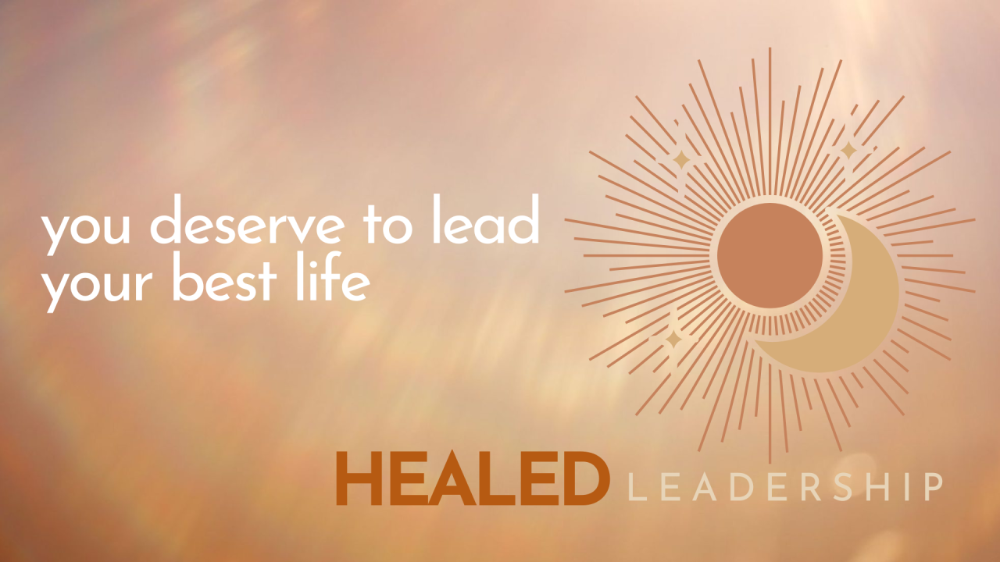

# Welcome to Healed Leadership

Here's the quiet truth no one talks about: You can't outperform your inner world.

Burnout, self-doubt, quiet quitting, feeling stuck? They're not signs of failure or futility. They're invitations. Invitations to heal, grow, and lead in a way that leverages your innate strengths and wisdom.

Just because you _can_ hustle, doesn't make it your only choice. And just because you _can_ do hard things, doesn't mean it has to be hard. You deserve better.

Because you didn't signup for the grind. You signed up to make an impact. To create something meaningful—an experience of life and legacy you're proud of.

### Healing belongs in the workplace.

When I first started talking about the Healed Leader, I resisted. “Healed” felt too linear: broken > fixed > done. I’ve been down that path before. And it led to burnout. Hard.

But now, I see it differently. **To be healed is to** **_stay in healing_****. To be a leader is to** **_stay in growth_****.**

The old paradigm of burnout-driven success is dying. In its place, a new archetype is emerging: **The Healed Leader**. One who knows that limitless power lies not in relentlessly grinding, but in tapping into the endless wisdom of the body, the intuition of the heart, and the grace of spirit.

### Because leadership without inner work is just management.

This is the future of leadership. And it starts with us.

**I’d love to hear from you**:

*   What does “healed leadership” mean to you?
*   What topics would help you lead with more purpose and impact?

👉 Let's build this conversation—and future—together. Stay tuned and subscribe for bi-weekly insights, tools, and practices to help you live and lead as your best self.
