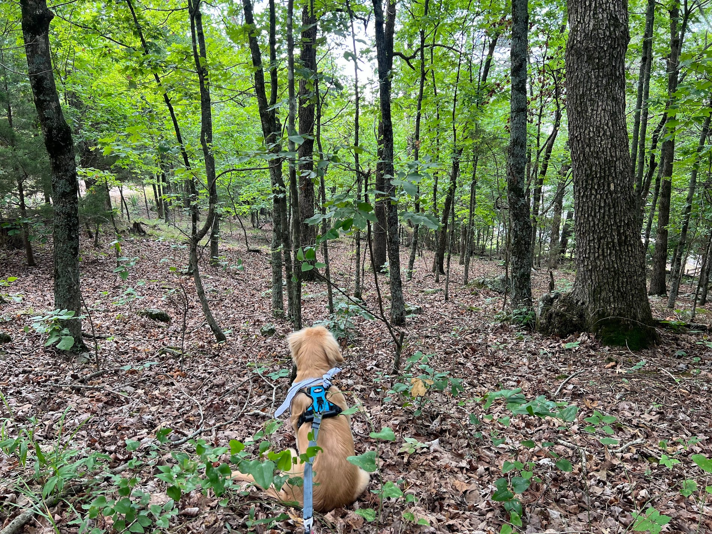

# Seeing the forest for the trees
*Sometimes it's hard to see the forest when you're in the trees—or find your way out of the weeds. Here's what I've learned walking my puppy.*

I like to imagine that when my pup stops on a walk, it's to _soak_ in the three-dimensional scene. To _savor_ the bouquet of animal droppings and decompositions that swirl and twirl with tiny currents that rustle leaves. _Immerse_ herself in the Stone Soup symphony of songbirds, out-of-time and synchronous.

Is she rummaging through an infinite catalog of objects, trying to rapidly map what she can identify from this cacophony? This is where I can spend an infinity chasing down rabbit holes and getting stuck in the trees and weeds, because it’s terrifically fun for foragers like me!

But I sense she’s “seeing” the forest, in so much as we can see without our eyes.

In this seeing, we're not Seeking to distinguish the _what_ it is that we're looking at (or FOR), but rather Receiving: allowing the light, sounds, scents, textures to come to us, rendering a sensory map of the space around us. (Rabbit hole alert: I'm suddenly thinking of dolphins and echolocation and ultrasounds.) It’s passive, yet actively intentional.

It's with this paradoxical receiving-seeing that I can practice seeing the forest beyond the trees. And bond with my baby girl.

**PRACTICE:** wherever you happen to be reading this, take a moment to switch your receiver on, safely. Often, we practice sensing by closing our eyes, but I encourage you to practice with your eyes open. This is multi-fold. Our eyes help ground us in the present moment. And it helps us build the muscle of sensing with the distractions of light so we can flex it even when we’re actively engaged. Start small: a few seconds to a minute a handful times a day because repetition is key.

**REFLECT:** How do you gain altitude to see the forest through the trees when you find yourself stuck in the weeds? I’d love to hear about your process.