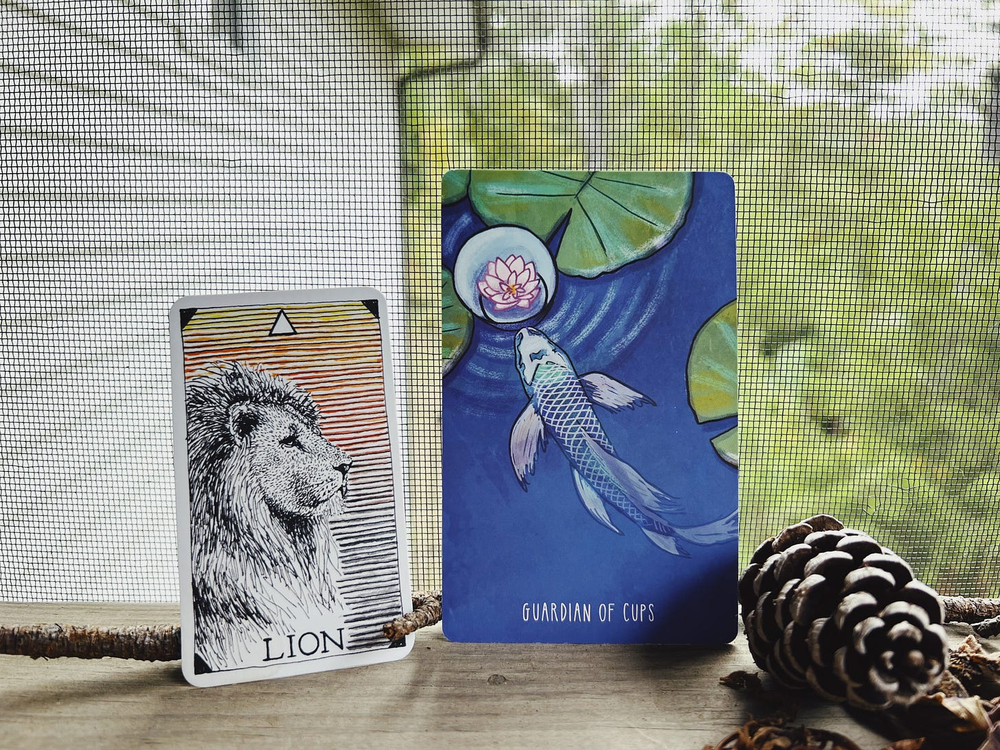

# Morning Intention: Inviting Self-Mastery [3m]

*Tuesday's Tarot: living in both our inner and outer worlds and the transformation of fire and water*

<small>*Artwork from the Spacious Tarot at thespacioustarot.com*</small>

This morning’s pull and practice remind us that we exist in multiple worlds simultaneously: our own, inner one, and our shared, external one. We can easily allow the external to rule our inner, or vice-versa. Self-mastery allows neither to rule the other and is available to all of us, independent of where our quest begins. 

**Guardian of Cups** (water) — as the fish swims to the lotus flower, we’re reminded to let our intuition guide us forward, to listen to our heart. Our hearts inherently know what is best for ourselves as individuals and the whole, for it circulates the life force we all breathe and share.

>**PRACTICE:** Imagine you’re a fish in a pond. Rain starts to fall, creating ripples on the surface. These droplets are carrying stories, and as you stay at the surface, it can feel thunderous. All these stories colliding into you at once. It’s easy to forget that they’re not yours—that they fell from the sky. You may call them your fears, your worries, your insecurities because the collisions reverberate inside of you. Now, allow yourself to swim a little deeper. Down here it’s quieter. The stories raining now dissolve into the water you swim effortlessly through, no longer something you have to battle. Down here, you have shelter from the noise of the world and can hear your own heartbeat. Feel for *your* rhythm. What is it that your *heart* is drawn to? What is *your* tempo? What is *your* truth?

**Lion** (fire) — patient, regal, mastery. As water puts out fire, fire boils water—both are transformative. What a beautiful reminder of balance: to both swim in our (watery) emotions inside of our internal landscape and to take graceful (fiery) action in our external world. To not let ourselves get lost in either, and to allow each to transform the other. “Lions are observant, stealthy, and precise in their words and actions. They do not waste energy or resources. This card reminds us that self-mastery is available to all, no matter where our quest begins.” 

When in balance, Lion energy is peace and strength. To bring into balance: daily meditation & friendship. —*Kim Krans in The Wild Unknown Animal Spirit Deck*

Unstruck Soundbites is a reader-supported publication. To receive new posts and support my work, consider becoming a free or paid subscriber.