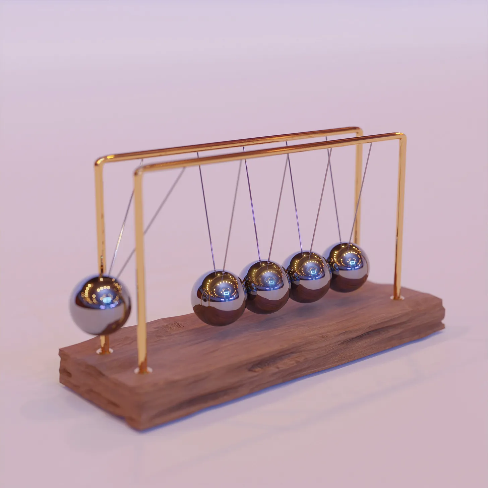

# Momentum and Rest: making Mondays less of a chore

*a practice to support you in starting a new day by leveraging the law of inertia*

Mondays are often loathed as a burdensome restart for those working a M-F schedule. The Law of Inertia tells us that it’s much easier to continue in motion than to create motion. However, when we take the weekends “off” we stop only to start again, consistently expending energy in this cycle of stopping and starting. So how can we both **stay in motion** to leverage our momentum _and_ **rest** to recharge?

Today’s practice is an invitation to create space for motion to return (vs creating it) as you start your new day/week. As with all practices, take what works for you and leave what doesn’t.

<small>*Photo by [Sunder Muthukumaran](https://unsplash.com/@sunder_2k25) on Unsplash*</small>

**PRACTICE:** Give yourself 5-10 minutes—_the aim is for enough space to not feel rushed while also having a limit so that you can fully submerse yourself in the experience w/out worrying it will get in the way of other commitments._

First, take a deep breath and feel for your feet and your seat as you ground into simply being. Notice how it feels to allow yourself to be still and at rest while on a planet that is spinning. _(You can even start this while still in bed.)_

What did you accomplish yesterday/last week? Jot down as much as you can within **2 minutes**. These can be anything/everything from work, sticking to a new habit, connecting with friends, cuddling with pets, watering a plant, a moment when you showed up in a way you’re proud of, getting enough sleep... allow whatever comes up to come up. _(If you like to jot this stuff down at the end of your day/week—that’s great! Pull out your list and review it.)_

Now, take a deep breath and feel for your feet and your seat as you ground into your accomplishments. What are you most proud of? If this were a friend sharing their list, what would you say to _them_? Allow yourself to receive this. Notice what movement wants to stir in your body, and let yourself move for 2 minutes in any way that feels good.

Now, let this movement guide you into starting your day/week with momentum after a well-deserved rest.

**REFLECT:** If you noticed resistance inside of this practice, or simply in thinking about doing it, that’s OK and perfectly normal. Where did you notice the resistance rising from? What is it telling you? What did you learn from this practice?