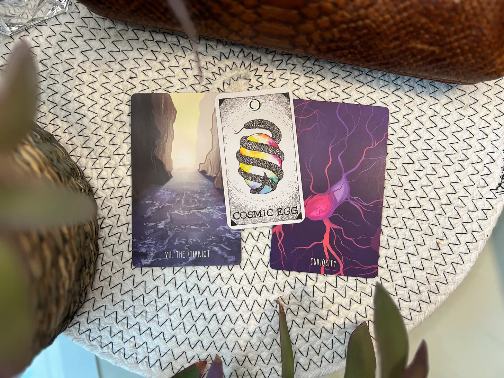

# Your Chariot has Arrived (with a Full Moon)

*Practices to harness this Full Moon Chariot energy&#8212;to stay the course with curiosity and determination, present to the journey alongside the destination*

Wow has this week been INTENSE. Anyone else feel like they've been pushing uphill, laser-focused on their goals? Waxing gibbous (half-moon to full-moon) energy had me in a WORK trance. But guess what? It's finally FULL MOON time—time to unleash all that pent-up creative juju (which is what my brothers used to call me when they couldn’t yet say ‘jewel’).

Earlier this week, I pulled the **Chariot[^1]** card (again!). It seems like the Universe is giving me (and maybe you?) a nudge to stay the course. Determination is key right now. Obstacles? Pshaw…we got this! Just gotta keep our eyes on the prize and steer our Chariot towards the light (literally, with this full moon beaming down on us).

Here's the thing: **Curiosity**[^2] is our co-pilot on this ride. It can be tempting to put on our blinders to stay the course—and forget to keep our gaze soft. Curiosity reminds us to stay open, live in the QUEST of the question, and don't get _too_ hung up or blinded by focusing on finding all the answers. We can’t reach our destination without a journey, amiright?

And that brings us to: the Cosmic Egg[^3]. It’s the final card in the Animal Spirit Tarot deck and is all about completion, harmony, and the infinite possibilities within each of us. So yeah, we’re wrapping things up, but it’s not really an ending. Just another turn in the spiral.

So here’s some **practices** to harness this Full Moon Chariot-with-Curiosity energy:

1.  **Visualize:** Close your eyes and see yourself in your Chariot, reins in hand, bathed in moonlight. Where are you going? What's driving you?
    
2.  **Affirm:** Say this out loud (or write it down and place it where you can see it and read it to yourself in your head): "I am strong. I am determined. I am guided by curiosity and fueled by the infinite power within me."
    
3.  **Express:** Dance, sing, write, create! Let this full moon energy flow through you and express itself.
    
Happy Full Moon, everyone! Let's ride this Chariot with wild abandon and see where it takes us.

[^1]: Chariot card and artwork from [The Spacious Tarot](https://thespacioustarot.com/)

[^2]: Curiosity card and artwork from [The Spacious Tarot](https://thespacioustarot.com/) expansion deck

[^3]: Cosmic Egg card and artwork from [The Wild Unknown](https://kimkrans.com/the-wild-unknown) Animal Spirit deck

<audio controls="controls">
  <source type="audio/mp3" src="https://api.substack.com/feed/podcast/150357899/068e8686a9d84e201ebfdc6ef6a24929.mp3"></source>
  
https://api.substack.com/feed/podcast/150357899/068e8686a9d84e201ebfdc6ef6a24929.mp3

</audio>
