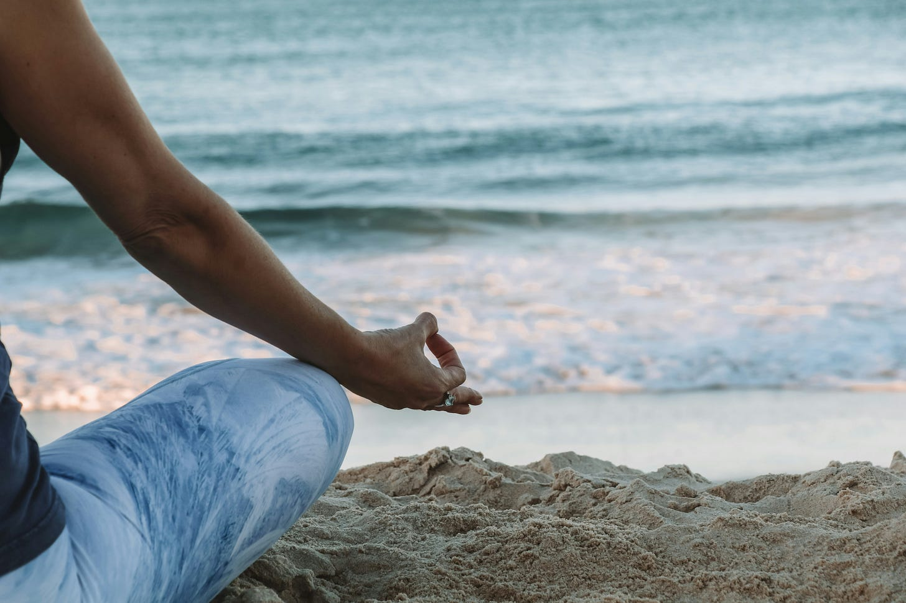

# Ocean Breath for Self Care + Calm

*A "pocket practice" you can take and do anywhere, for self care and calm*

Do you ever wish you could steal away to the ocean or beach anytime you could use some restorative time? This is a mini practice you can enjoy anywhere, anytime that’s like conjuring the ocean. One of the many reasons self-care slips down the towering priority ladder is that we equate it with vacations, getaways, and lavish hours when we can turn off all devices and unplug. Those are all awesome, of course, but if you’re someone who feels the constant pressure of having to be “on”, available, and juggling myriad responsibilities, waiting for such times can mean we rarely-to-never get around to it.

So here’s my gift to you—and myself—a tiny but luxurious practice you can pull out of your pocket anytime you need it. Heck, I dare you to try it even when you don’t think you need it.

> What’s your experience of this practice?
> 
> What are some of your go-to self-care practices? I love learning (and practicing) in community!

_For more on this practice and other breathwork inspiration, check out Nathalia Westmacott-Borwn’s “[BREATHWORK—a little book of self care](https://www.powells.com/book/-9781465485052)”._

<small>*Photo by [Chelsea Gates](https://unsplash.com/@chelseacgates) on Unsplash*</small>

<audio controls="controls">
  <source type="audio/mp3" src="hhttps://api.substack.com/feed/podcast/151925988/fab05e75dcf26d85da9e614f77d1f69d.mp3"></source>
  
https://api.substack.com/feed/podcast/151925988/fab05e75dcf26d85da9e614f77d1f69d.mp3

</audio>
