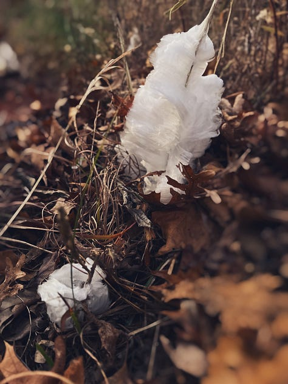
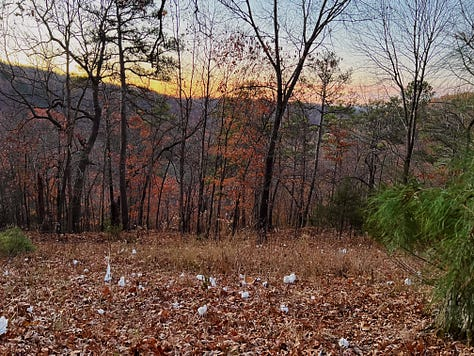
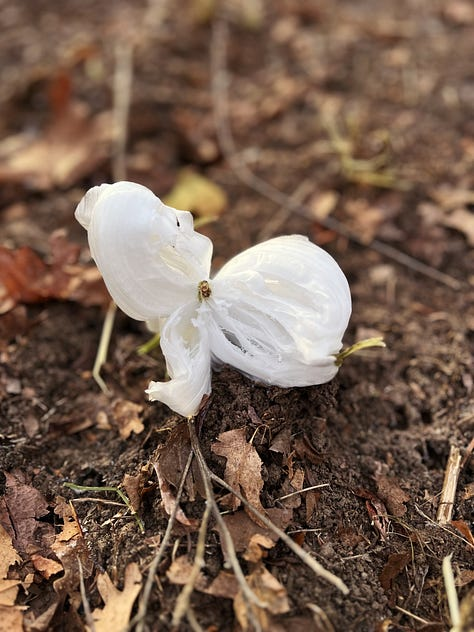
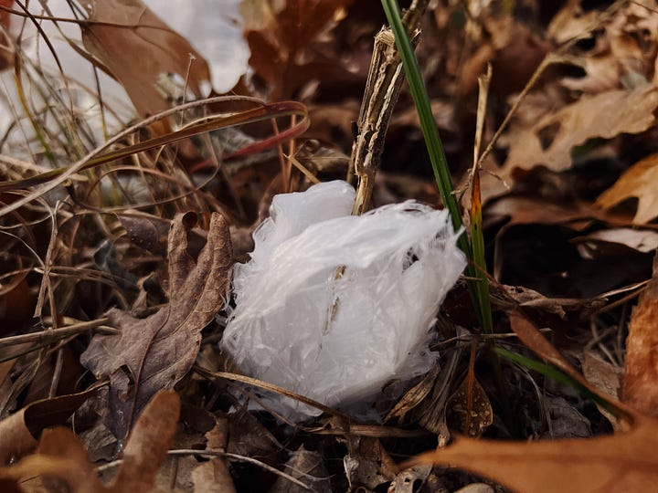
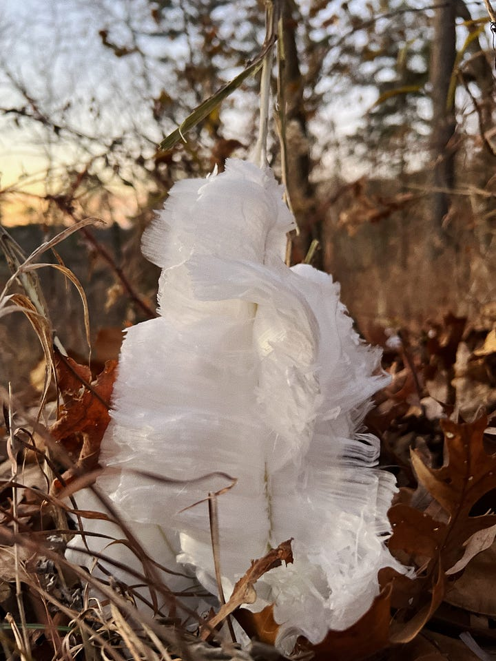

# The Art of Wintering: Finding Gifts in Frost Flowers

*A reflection on nature's seasons of abundance and scarcity to create connection in a disconnected season.*

This morning I woke to frost flowers (at the base of Virginia Crownbeard, aka “Frostweed”, plants)—magical ice sculptures spiraling from withered stems along a new trail cut through our back woods. They appear only on the coldest mornings, when conditions align perfectly: the soil still warm enough for sap to flow, the air cold enough to freeze it as it seeps through tiny cracks in the stem. They stand out in an otherwise barren landscape, reminding us to stop and smell the roses, or more aptly, to slow down and notice an abundance of winter’s gifts. Some of them even look like ribbons in case you miss the subtle cues—this is about receiving.

<small>*frost flowers dappling and dazzling our backwoods*</small>

### Winter’s Rhythm

Everything in nature knows winter's rhythm. Bears curl into caves, birds fly south, plants hunker down into their roots, and our own bodies signal for rest - craving warmth, sleep, and quiet even as our culture pushes us toward constant motion and artificial light. It's not deprivation—it's **wisdom**.

Like a mushroom that can kill with a nibble or water that’s lethal in excess, nature teaches us that benefit and harm lie in timing and measure. The same holds true for seasons and their gifts.

Winter shows us how scarcity builds resilience, while abundance feeds growth. We hear a LOT about cultivating an "**Abundance Mindset**," as if scarcity were something to avoid. But, like frost flowers, beauty emerges from limitation. In scarcity, we build self-reliance and awareness. In abundance, we create possibility and ease. Neither state tells the full story; each carries its own medicine and its own poison. The magic lies in knowing when to draw in, when to expand, and how to dance between the two.

### Dancing with Scarcity and Abundance

The old fable of the Ant and Grasshopper shows us this dance: preparation meeting presence, storage meeting surrender. The Ant works through summer, storing food for winter. The Grasshopper plays, living fully in abundance. Like many of us, I was taught Ant was wise, Grasshopper foolish. But Grasshopper's joy called to me—surely life meant more than endless preparation. And so, somewhat intentionally and mostly foolishly (with the wisdom of a proper Fool[^1], I lived—and learned—from both.

In my twenties, I worked while others played, but refused to choose between the two. I built work that let me travel and spend time with loved ones. (Though waking up covered in kittens after an all-night-work-session proved some attempts at balance were questionable.) These lessons saved me when real scarcity hit—when I left an executive job just as the Great Recession was landing and invested all my time and money into a startup that didn’t pay me for 4 years. I learned to hibernate, cutting expenses and costly habits like drinking. But I also learned scarcity's shadow side when I cut too deep, sacrificing health. Like our annual seasons, each season of my life has shaped how I navigate between preparing and playing, storing and spending.

### Receiving Winter's Invitation

And here we are, once again, fighting winter's invitation to slow down. We blaze lights against early darkness and pack our calendars when our bodies beg for quiet. The holidays disconnect us while purporting to exist for the purpose of connecting us.

I used to think winter was exhausting because of all the holidays, but now I wonder: is it simply because we're battling our natural rhythms? Summer chaos feels different—we expect it, embrace it even. But winter? **Our cultural attachment to abundance has transformed a season meant for rest into a marathon of consumption and obligation.**

**When we align with winter's rhythm rather than resist it, we discover that scarcity and abundance aren't opposites, but partners.** Like frost flowers emerging from the perfect balance of warm earth and cold air, growth happens when we honor both. Winter invites us to dance between preparation and presence, between the Ant's wisdom and the Grasshopper's joy.

I invite you to pause and accept this invitation with me—to receive the gifts that appear only in stillness.

### Reflection Questions

> *   How can you create pockets of pause in your hectic holiday schedule?
>     
> *   What might you notice if you slowed down?
>     
> *   What gifts are hiding for you in plain sight?
>     
> *   What abundance hides in your scarcity?
>     
> *   What wisdom waits in the quiet moments between doing and being?

[^1]: The Fool in Tarot represents infinite potential and with a beginner's mind—stepping off of cliffs with trust. It honors the wisdom inherent in all of us. Not reckless, but embracing uncertainty with eyes wide open.

