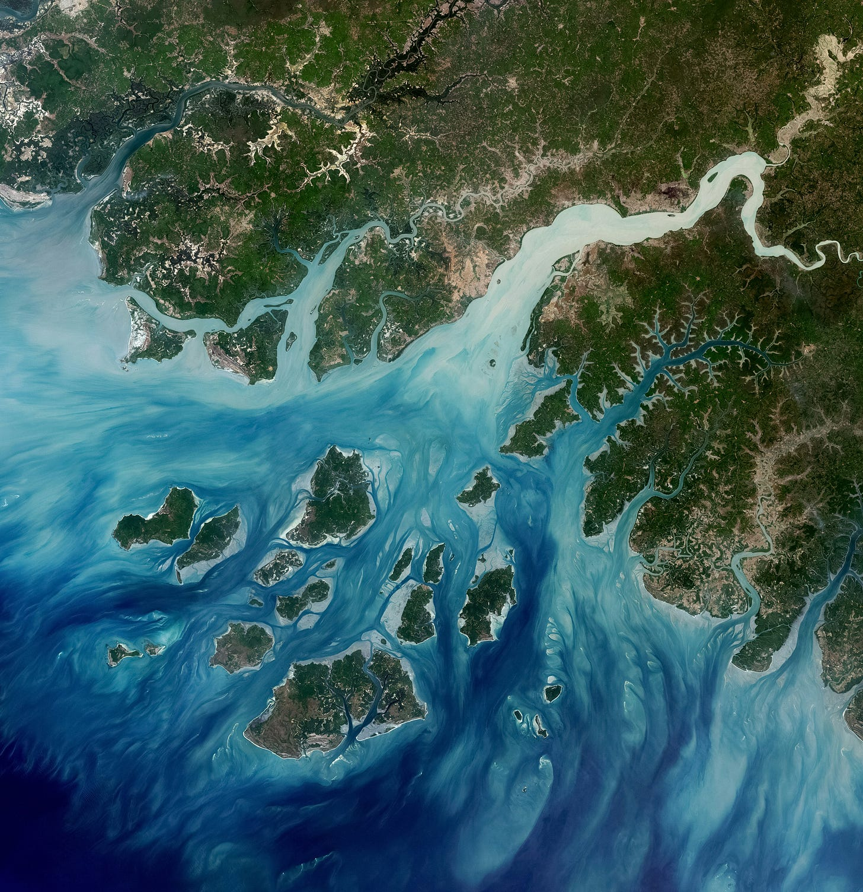

# On Being and Becoming: Where the River Meets the Ocean

*A poem and practice honoring what scares us*

<small>*The Geba River on the west coast of Guinea-Bissau in 2022. Photo from [USGS](https://unsplash.com/photos/multicolored-abstract-painting-qTV6c2pjbBo).*</small> 

Fear of the unknown and inevitable is universal and wise. It signals that we’re paying attention. That we care about being alive. To honor our fear is to honor our aliveness. To honor our fear is to listen for its lessons. It was never meant to stop us, but to wake up—alert us to the wild wonder that we’re alive—simultaneously existing and becoming.

This week’s quick yet spacious read1 and inspired practices come from a poem commonly attributed to Khalil Gibran2

“It is said that before entering the seaa river trembles with fear.She looks back at the path she has traveledfrom the peaks of the mountains,the long winding road crossing forests and villages.And in front of her,she sees an ocean so vast,that to enterthere seems nothing more than to disappear forever.But there is no other way.The river can not go back.Nobody can go back.To go back is impossible in existence.The river needs to take the riskof entering the oceanbecause only then will fear disappear,because that’s where the river will knowit’s not about disappearing into the ocean,but of becoming the ocean.”

*—FEAR, KHALIL GIBRAN*

Lena River, Russia 2019. Photo by USGSWhen I think of my fears, my first instinct is typically to avoid, hide, dissolve. And then I think of the river becoming the ocean, surrendering to gravity and the inevitable. I imagine myself holding my breath until I realize that I belong here—I can breathe here. It’s in this belonging that I can let go of what was and retain what always will be inside of what’s new. It’s in this belonging that I don’t have to disappear into my fear and can expand beyond. This kind of belonging and becoming isn’t one-and-done. (No one steps into the same river twice, after all.) It’s a practice, that like all practices, find power in repetition.

> **A Grounding Practice: River Meeting Ocean**

Stand and imagine yourself as a river

Feel your "headwaters" at the crown of your head

Slowly move your attention as you “flow” downward through your body

Notice where you feel contraction or constriction, resistance or fear 

Notice where you feel expansion

As you end at your feet, notice what it feels like to meet the “ocean” and then become the ocean as you extend energetic roots into the earth, lengthen in your energetic tether to the sky, and feel into your “3D” presence

**Questions for Reflection**

What's your ocean—your future that you're resisting and becoming? 

What wisdom lives in the place where your resistance meets your longing?

1One of the many reasons I love songs and poetry is for their power to stop time—I can get lost in their lines, feeling a memory long forgotten, seeking to soak in their magical ability to shift my mood, a mystery begging me to linger. And when I linger, they extend an invitation, an offering, a question—along with a reminder that I’m not alone. I call these spacious reads for the space they create for me to simply be with myself. Contrast that with the art and media I consume to escape being with myself.

2While commonly attributed to Khalil Gibran, I wasn’t able to find a primary source of this poem. I did find a reference to a possible source by another author, proposing that it evolved (and was channeled) through multiple authors. 

