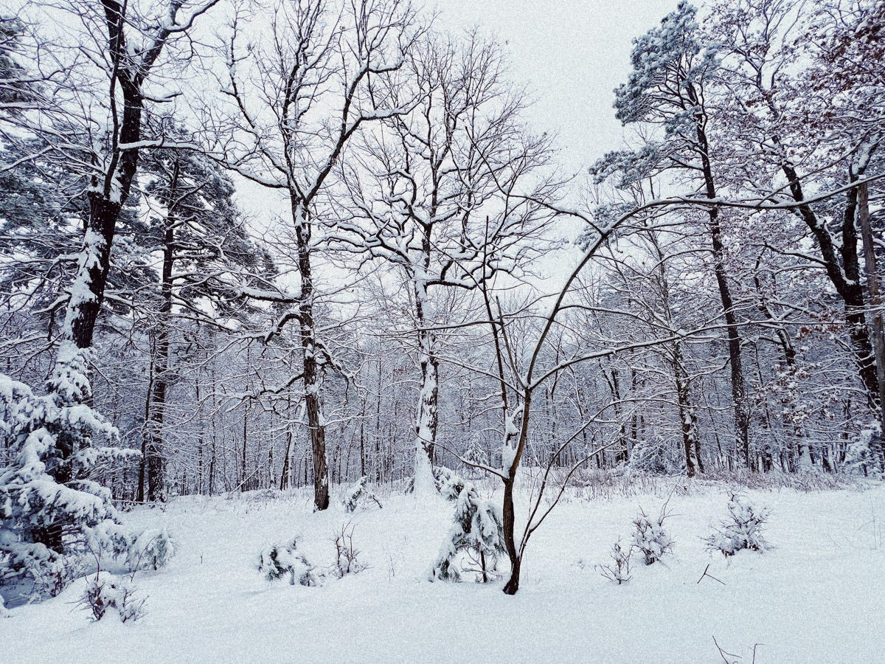

# Wintering While Starting a New Year

*Honoring my own pace without dropping out of the human race*

I've been remiss to restart Soundbites, caught between winter's call for hibernation and the pull to stay connected and birth a new year. How do we hibernate without hiding? I'd love your help if you've figured it out and your company in the journey of exploring. From the book that introduced me to the verb of winter:

> Plants and animals don’t fight the winter; we\* don’t pretend it’s not happening and attempt to carry on living the same lives that we lived in the summer. We prepare. We adapt. We perform extraordinary acts of metamorphosis to get us through. Winter is a time of withdrawing from the world, maximizing scant resources, carrying out acts of brutal efficiency and vanishing from sight; but that’s where the transformation occurs. Winter is not the death of the life cycle, but its crucible.
> 
> — [Katherine May, Wintering: The Power of Rest and Retreat in Difficult Times](https://katherine-may.co.uk/wintering) _(\*I’ve changed “they” to “we”)_

These words hit differently this year, as I replace "them" with "we" to include myself. I'm done pretending that I can generate and sustain the same energy throughout winter as I do in summer. Where I’m at, it’s COLD. And I don’t _like_ it. It stings. Yet, I _love_ the feeling of warmth hugging a frozen tickle and bundling up in fluffy, fuzzy, furry fashionables. I don’t _like_ missing out on shared experiences with friends and family. Yet, I _love_ the simplicity of only needing to check in with myself for a spell. Like in comedy, it’s the contrast that brings delight.

But I haven’t yet found the delight in the contrast of wanting to rest—to spend more time closing out my old year—against the pull of starting strong and the burden of being a coach wrapped up in the hype of “new year, new you” action. I’ve been wronging everything about New Year’s—the timing, traditions, pop culture. Until a friend challenged me: **What if this** _**is**_ **the perfect time to celebrate? How does that impact** _**how**_ **we celebrate?**

1.  From the calendar’s story[^1], when we wrote that winter is not the death but the birth of a new year, we wrote that winter is also the womb, a gestational season, and its conception. This makes now a fitting time to impregnate myself with the futures I will birth in due time—shifting my focus from the action of giving birth RIGHT NOW to concepting. And just like that (finger snap!) … intentions, mottos, resolutions make different sense.
    
2.  As for how to celebrate, I’m giving myself permission to honor my own pace inside of the Human Race.[^2] I know I need a grizzly bear’s den of space to keep reflecting, exploring, and experimenting as I create what will later be birthed, knowing that not everything conceived will survive beyond this season.
    

The delight, I’m discovering, lives in the juxtaposition of hibernating while connecting through the sharing of unfinished discoveries. And my practice is to give myself lots of space—several Soundbites if you will—to let intentions root deeply in the dark, quiet soil of winter before asking them to bloom.

**As you winter, what delights are waiting for you in the space between hibernating & connecting?**

I’d love to hear from you in the comments or my inbox. Cheers to however you’ve chosen to conceive and ring in your new year!

[^1]: For those screaming that it’s not winter for everyone celebrating the Gregorian Calendar’s New Year’s—this is simply honoring that this calendar originated in the Northern Hemisphere without regard for how others around the world experience the seasons.

[^2]: The proverbial life race of humans racing and the fastest mount the podiums and take home the golds.