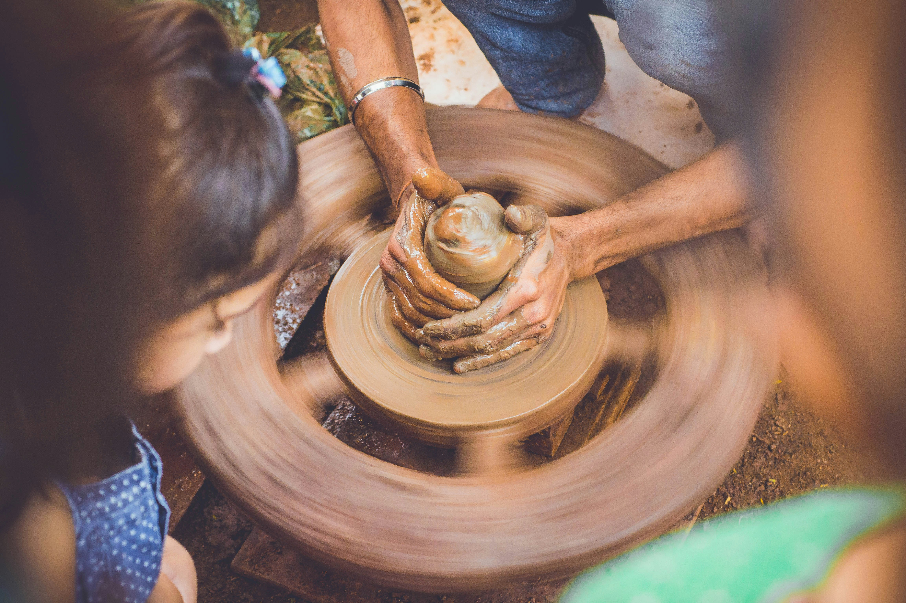

# The Art of Intention: from Ruts to Rituals

*Exploring the difference between routine and ritual&#8212;turning repetition into reverence&#8212;and why it matters.*

<small>*Photo by [Shayne Inc Photography](https://unsplash.com/@shayneincphotography) on Unsplash*</small>

When I was a child, I went to mass every morning in Catholic school, and again on weekends with my dad. I knew every word by heart—spoken or sung. Over time, this repetition fruited daydreams that grew fantastically into song-and-dance theatrics, starting with me jumping up and out of the pews to wake everyone up. If I’d seen a zombie movie by then, I would have described my experience of church as hanging out with the living dead. From my monotonous seat, repetition numbed not only me—but everyone else around me. I didn’t yet have the language to describe it as the difference between feeling the reverberation of an upright bass through every bone and muscle in my body and simply hearing a low note float past my ear like a ghost passing through walls. One was simply real. Full stop.

If you’re like me, you might have a complex relationship with routine. On one hand, they’re necessary—the scaffolding that holds up our days. On another, they feel like creativity killers—banal, vanilla, zombie-makers, tools to keep us distracted while a greater conspiracy unfolds. I spent years rebelling against them[^1], clinging to freedom as something only attainable without them.

I am, after all, a double Cancer (born at sunrise): ruled by the moon, water, and emotions. I shall not be shackled by the agonizing task of repeating mindless, soulless acts just because it’s a norm. And the myth of the lemmings loomed large in my childhood.[^2]

Here’s the thing: I wasn’t wrong. Routines can be all those things. They create grooves and ruts, and ruts can be handy when you need the grooves to guide you. And they can make it harder to change lanes, to pivot, to explore new directions. The difference, I’ve learned, looks no different on the outside yet feels as vastly different as being Pinocchio the puppet versus Pinocchio the boy.

### **The Shift: Routine to Ritual**

When we infuse structure with intention, we transform routine into ritual. We create ruts along paths _we_ choose, not those chosen for us. And when we remind ourselves of our “why”—our _for the sake of what am I doing this?_—we shift from riding the grooves to carving them. This, above anything sacred or precious, is the true essence of ritual: a space where we’re both in a groove and actively deepening, shaping, and refining.

I grew up Catholic, a tradition that, for all its flaws, understood the power of ritual. It absorbed and repurposed the rituals of decentralized, polytheistic folk religions, honoring an interconnectedness of mind, body, and spirit[^3]. For some, these practices felt like routines—obligations to survive or assimilate. For others, they were profound rituals, imbued with meaning and connection. Same actions. Very different experiences.

Take St. Francis of Assisi’s sentiment: _“She who works with her hands is a laborer. She who works with her hands and her head is a craftsman. She who works with her hands, head, and heart is an artisan.”_[^4]

### **Productivity Hacks vs Rituals—Laborers vs Artisans**

I’ve started talking to young elders and entrepreneurs about the rituals they hold dear. Not prescribed routines or productivity hacks, but the intentional practices that ground them, inspire them, and keep them connected to their “why.”

These rituals may start as rebellions—against structure, expectation, the status quo. They can be happy accidents, intuitive meanderings, or deliberate creations. They’re always deeply personal and meaningful because they invite us to bring not just our hands and heads, but our hearts, into what we do.

They’re the difference between labor and love.

### **An Invitation**

I’m not sure yet when or how I’ll be sharing these interviews and rituals—but I’d love to connect with you around yours. **This is just the beginning of a larger exploration, and I’d be honored to include your story.**

So, I’ll leave you with this:

1.  Where in your life do you feel the numbing weight of routine?
    
2.  Where do you crave—or already practice—ritual?
    
3.  What would it look like to infuse your daily actions with intention—carving the grooves of your choosing vs those laid out for you?
    

If you’re an entrepreneur or creative with rituals you hold dear, I’d love to hear your story.

[Book a 15-min Ritual Interview](https://calendly.com/jewel/rituals-interview?month=2025-02)

And if you’re not up for a chat, I’d still love to hear from you. Drop a comment below to share one ritual that grounds you or brings meaning to your work.

[^1]: And arguably, all my savings and years of income building a startup rooted in breaking out of routine to support the freedom to work and live anywhere.

[^2]: For those who can reminisce about their parents’ cajoling, “If everyone else jumped off a cliff, would you do it too?” did you know that the lemming myth stemmed from a 1950s [Disney documentary](https://en.wikipedia.org/wiki/White_Wilderness_\(film\)) on the cute little rodent?

[^3]: I first learned this in Catholicism as God being the word (the Father), the flesh (Jesus), and the spirit (The Holy Spirit)). Later, I learned this outside of religion as mind, body, and spirit.

[^4]: This is not verbatim _(his languages included Provençal, Latin, some French, and Umbrian)_ and I can’t find a source linking him to the inspiring quote—so this may be one of the numerous misattributed quotes that gets us to pay attention to wise words by attaching them to respected figures. Regardless, this [beautiful post](https://medium.com/@douglasfouts/the-hands-the-head-and-the-heart-153452e94b20) includes the modern-day quote that inspired this sentiment and an impactful reflection against another one: “We have been paying people for the hands for years, but they would have given us their heads and their hearts for free…**if we had only known how to ask them for it.**”