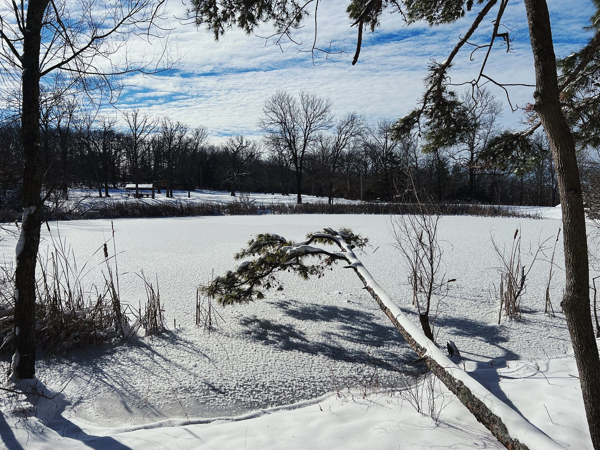

# A Practice for Expanding Your Perspective: a walk around a pond

*It can be easy to forget that what draws our attention is but a narrow sliver of a much larger experience that we can tap into with practice.*

Earlier this week I took a walk around our snowy pond and was AMAZED at the glitter sparkling—every step was magical. Even though I’d been walking this pond for a year, it felt new and alive with new beauty. 

If you’re like me, winter has been a season of deep reflection—and sometimes, that can mean going deep into a tiny sliver of my experience where it’s easy to forget that even though I’m exploring one angle … there are many others. None of them rob the others of their truths—or wrong them.

This week’s chat and invitation is to take on this expansive practice whenever you notice yourself ruminating. Where do you get stuck in a tug-of-war between perspectives? What does it feel like to shift into walking *through* them, taking additional snapshots from new angles? How do you do that?

Cheers to expanding your reflection practice and expanding your experience! I’m excited to hear what opens up for you as you “walk around your pond.”

With wild wonder & gratitude,

—jewels

### You’re Invited

If you’d like more support and community, I’m co-hosting a series of weekly guided practice circles called “Drop Ins” open to all Unstruck subscribers, *no fee*—30 minutes, spanning different days and times. Leave a comment or message me and I’ll share our calendar. 

Have a topic you’d like to explore or expand with practice and ritual? Let me know!

<audio controls="controls">
  <source type="audio/mp3" src="https://api.substack.com/feed/podcast/157745096/51822e04ea71ff0395f3f39ab6fbed14.mp3"></source>
  
https://api.substack.com/feed/podcast/157745096/51822e04ea71ff0395f3f39ab6fbed14.mp3

</audio>

