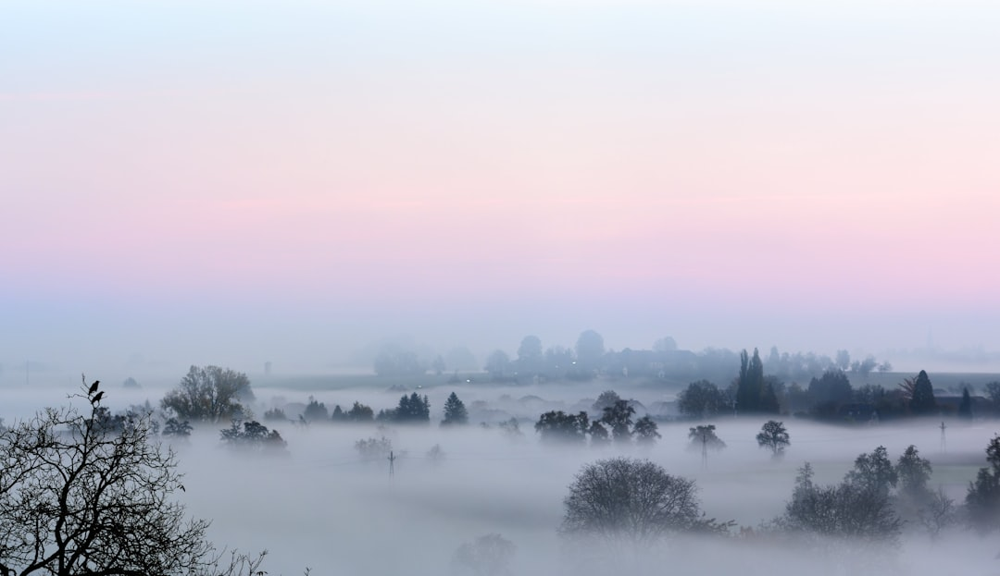

# The Automation of Attention: Reclaiming Presence in a Digital World
*Finding ourselves Here—where we sit/stand/lie*

*"Stand still... stand still. The trees ahead and bushes beside you are not lost. Wherever you are is called Here [...] Stand still. The forest knows Where you are. You must let it find you." — excerpt from a poem by David Wagoner inspired by a Native American teaching*

I've been thinking about attention lately—how it flows, where it lands, and how it's not just divided but increasingly *automated*. It seems like every entrepreneur I connect with these days mentions their ADHD, and it's no wonder! We've spent the last decade training our attention to be always on the lookout for and open to distractions. Our devices decide what deserves our focus, algorithms determine what fills our vision, and notifications choreograph the rhythm of our days.

This isn't a new insight—countless books, podcasts, and wellness influencers have been sounding alarms about our attention crisis for years now.[^1] What's emerging for me, though, is a nuanced challenge that's rarely addressed: the dangerous intersection where *distractibility* collides with our increasing dependence on *automation*.

To build physical strength, we need both flexion and extension. Similarly, healthy attention requires both sustained focus and appropriate distractibility. For millennia, this balance occurred naturally: we'd respond to vital interruptions while maintaining sustained focus on complex tasks.

But our modern environment has disrupted this equilibrium:

* On one hand, we're intensively training our "distraction response" neural pathway, like an athlete drilling the same movement thousands of times.
* On the other hand, we're neglecting to train the counterbalancing "sustained awareness" pathways. With automation, we've outsourced our capacity to notice, allowing this fundamental skill to atrophy.

The danger lies not in either trend alone, but in their convergence: we're becoming simultaneously hypersensitive to distraction and increasingly blind to our sensory world—leaving us vulnerable in a world capitalizing this imbalance.[^2]

This morning, I was reminded of all this when I opened a book by David Whyte to find this poem:

*Stand still... stand still. The trees ahead and bushes beside you are not lost.*
*Wherever you are is called Here, and you must treat it as a powerful stranger,*
*Must ask permission to know it and be known.*
*Listen... the forest breathes... it whispers,*
*I have made this place around you.*
*If you leave it you may come back again, saying Here... Here.*

*No two trees are the same to Raven.*
*No two branches are the same to Wren.*
*If what a tree or a bush does is lost on you,*
*You are surely lost. Stand still. The forest knows*
*Where you are. You must let it find you.*

*—poem, "Lost" by David Wagoner inspired by a Native American teaching*

How often do we truly stand still, allowing ourselves to be found rather than frantically searching? In our rush to capture, document, and share every moment, we've become strangers to presence itself.

The forest doesn't demand attention through notifications or dopamine-triggering alerts. It simply exists: breathing, whispering, waiting for us to be still enough to receive its knowing. The trees don't compete for Raven's attention; the branches don't optimize themselves for Wren's engagement. They simply are, in their complete uniqueness, waiting to be recognized by those who have learned the art of seeing.

What would it mean to reclaim this quiet power? To decide, consciously and deliberately, where our attention lands? To recognize that our attention is not broken—it's simply untrained?

## PRACTICE: Ground and See

This week, I invite us to practice building our muscle of *noticing* through a simple somatic exercise that helps regulate our nervous systems while training our attention. This practice takes just a minute, but can be transformative when stacked into our existing daily routines.

1. Choose an everyday moment when you typically reach for your phone (waiting for coffee, standing in line, getting out of bed).
2. First, **ground yourself** physically: Feel your feet. Notice the weight of your body against whatever is supporting you. Take one full breath, feeling your ribcage expand and contract.
3. **Stand still** in your attention. Look up and around.
4. Find something—anything—within your field of vision. A plant, a crack in the sidewalk, a stranger's shoes, the way light falls across your hand.
5. For 30-60 seconds, give this object or phenomenon your complete, undivided attention. Study it as if you were the first person ever to really see it. Notice its uniqueness, its particularity.
6. Ask silently: *What might I see if I treat this as a powerful stranger? What is lost on me that might be revealed if I stand still?*

You don't need to document this moment or share it. Let it exist purely in the realm of your own experience. Like the forest, let this practice find you wherever you are—in line at the grocery store, waiting for a meeting to start, or standing at a bus stop.

The beauty of this practice is that it requires nothing but your willingness to stand still in your attention, to reclaim the decision of where your focus lands. Each time you practice, you strengthen not just your capacity to resist attention automation but also your ability to regulate your nervous system and find that ventral vagal state—that place of social safety where you can truly be present.

This isn't about "fixing" your attention but about appreciating your brain's brilliance and intentionally training your awareness. It's about building a habit around noticing, bringing it into conscious choice.

**What might you discover when you stand still enough to be found?**

I'd love to hear what emerges for you through this practice. Share in the comments or reply to this email.

[^1]: Some of my favorites include Johann Hari's "Stolen Focus," Thom Hartmann's "Hunter in a Farmer's World," Dr. Gabor Maté's work on ADHD, and Jenny Odell's "How to Do Nothing."

[^2]: I don't want to make automation wrong. It brings with it so many great benefits—and wronging puts us in a counterproductive mindset. The issue isn't automation itself, but our relationship with it.